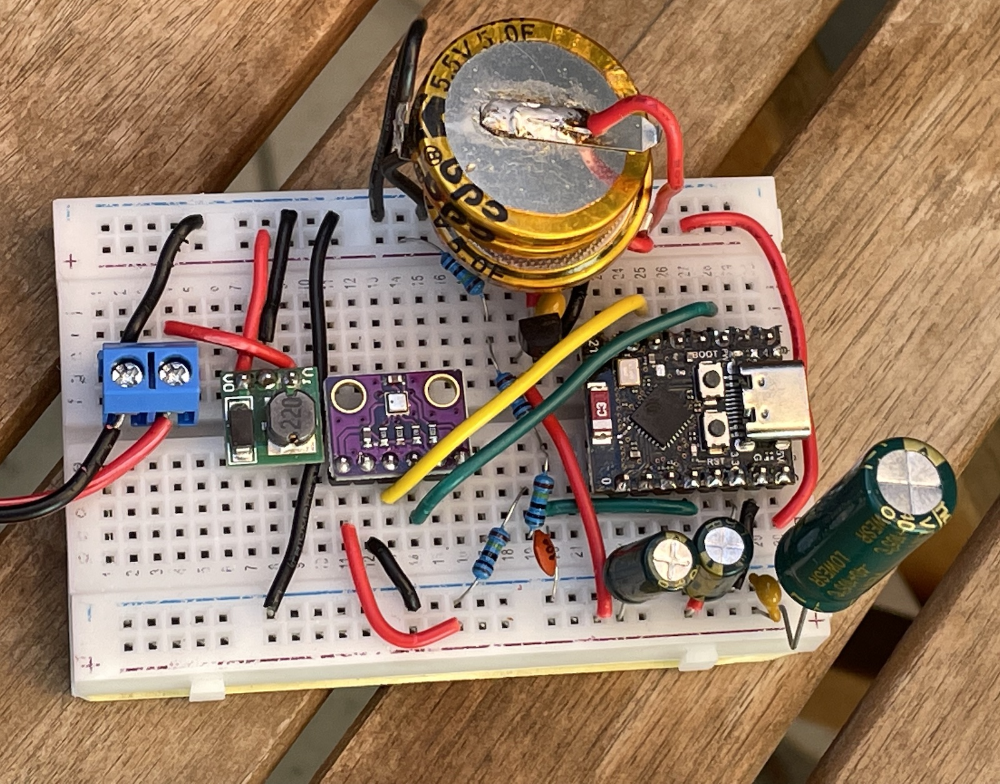
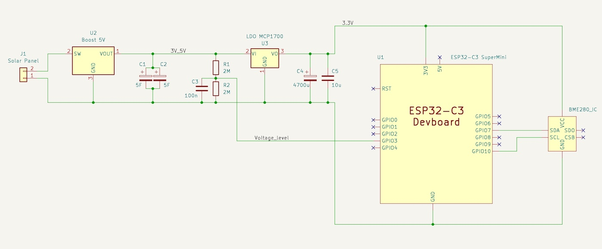
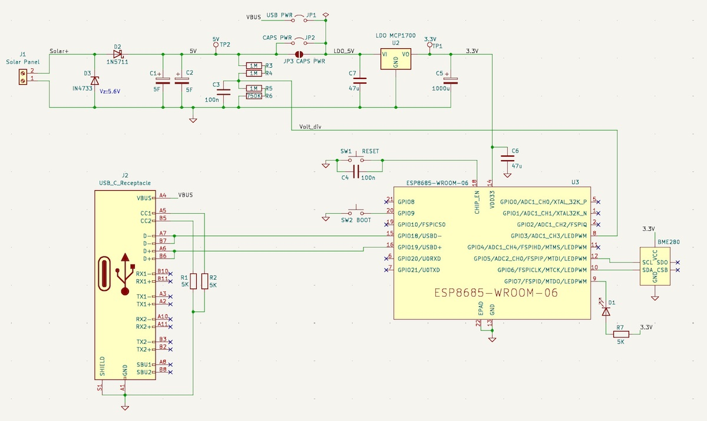
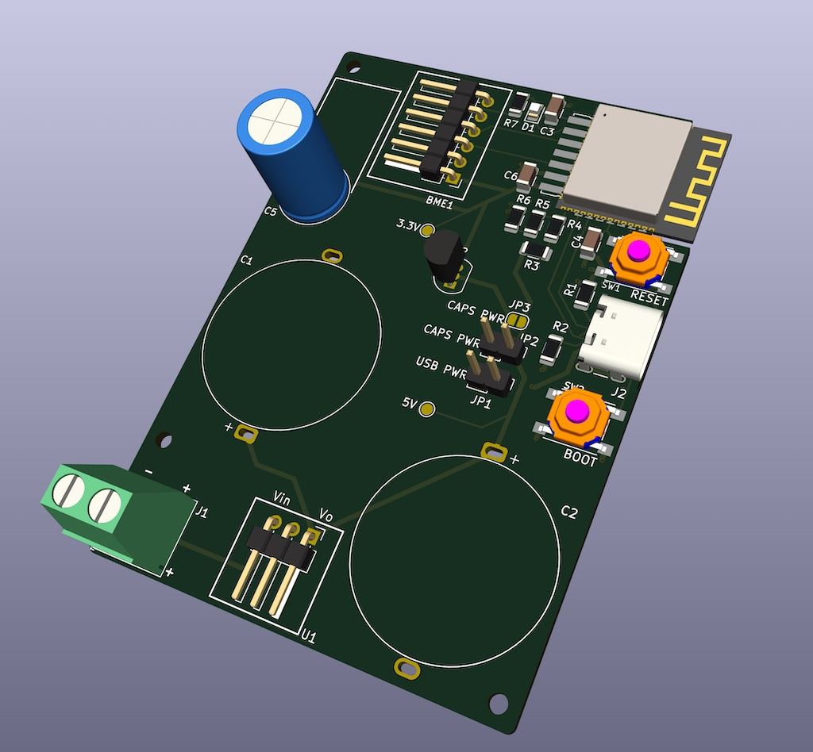
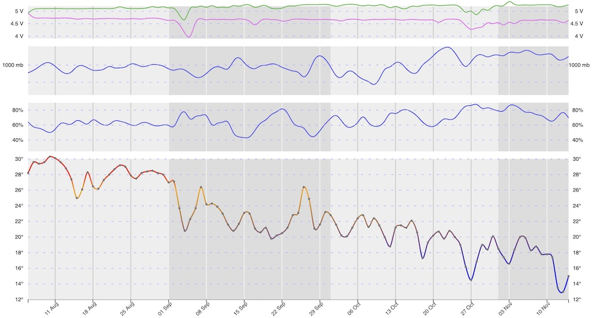

# ESP32-C3 Supercapacitor - Solar project
## ESP32-C3 weather station powered only with a supercapacitor and a Solar Panel

The ESP32-C3 is nice RISC-V microcontroller with relatively low power consumption.  

This project is a proof of concept on how to run a system like this, with regular wifi connection, without batteries. Just a 10F supercapacitor and a small solar panel (8 x 6 cms). It doesn't depend on any gateway in house, as it can directy connect to the internet to send the data.

The setup and code is very simple. The microcontroller stays in deep sleep most of the time. It wakes up every 15 minutes to take the weather measurements from the BME280 sensor ( temperature, humidity, pressure) and the voltage of the supercap. 

The measures are stored in the RTC memory and are only sent via WIFI if the charge of the supercap is at 95% or after a defined number of hours. This way the system can run and survive almost 3 days without any sun.

### Breadboard circuit

### The schematic

### New improved version: ESP32 module and schottky diode

For the new version I designed a simple PCB and replaced the ESP32-C3 dev board by the ESP8685 WROOM module. It's still ESP32-C3 but as a module soldered to the PCB.

I have a new solar panel with the same size but the nominal voltage is 5.5V.  This allows me to remove completely the boost converter and replace it by a schottky diode, what is more effient and has no quiescent current consumption. 

The Schottky should be one with very low reverse leakage current, to minize current lost during the night.

A 5.6V zener diode is added, because when the supercaps are full, the panel could go above 5.5V.  With this configuration the maximum voltage observed is around 5.3 V. 

All together the system is much more efficient, charges even when the sky is covered and the losses are smaller.

### PCB

## Current time schedule:

- Take one sample every 15 mins and send it via WIFI to the cloud.
- During the night (when voltage is below 5V):
  - Samples every 15 mins
  - Only every 8 connects to the WIFI and sends all samples
- If the supercap voltage is below 3.5V don't connect the WIFI and reduce sample period to 30 minutes.

With this test setup it survives more than 50 hours without any sun. When the sun is back in a couple of minutes the supercap is fully charged and sends all pending samples.

In the RTC memory it can store about 1200 samples, so it can keep sampling and waitting until the sun is back and the supercap is charged again.

The system is running for more than 2 years now. Some example of the data collected:

