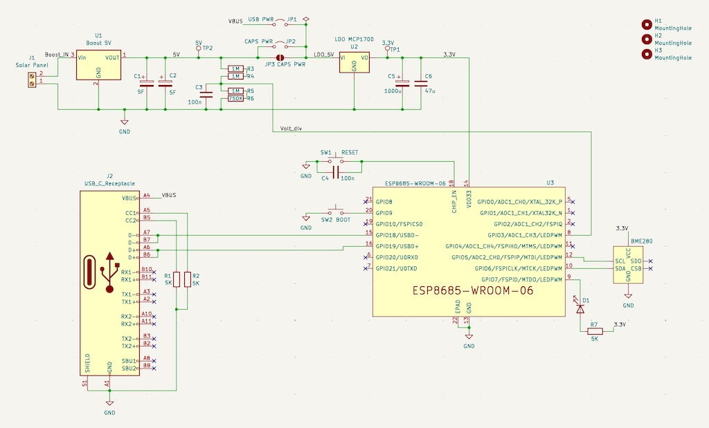

# ESP32-C3 Supercapacitor - Solar project
## ESP32-C3 weather station powered only with a supercapacitor and a Solar Panel

The ESP32-C3 is nice RISC-V microcontroller with relatively low power consumption.  This project demonstrates how to run it with just a 10F supercapacitor and a small solar panel (8 x 6 cms), without any battery.

The setup and code is very simple. The microcontroller stays in deep sleep most of the time. It wakes up every 15 minutes to take the weather measures from the BME280 sensor ( temperature, humidity, pressure) and the voltage of the supercap. 

The measures are stored in the RTC memory and are only sent via WIFI if the charge of the supercap is at 95% or after a defined number of hours. This way the system can run many hours without any sun.

### Breadboard circuit

### The schematic

### New version with the module instead of the devboard

### PCB

## Current time schedule:

- Take one sample every 15 mins.
- WIFI connection every 6 samples = 90 minutes. Or when the supercap is over 95% (sunny hours).
- If the supercap voltage is below 3.5V don't connect the WIFI and reduce sample period to 30 minutes.

With this test setup it survives more than 24 hours taking samples and sending every 90 minutes without any sun. When the sun is back in a couple of minutes the supercap is fully charged.

But after the tests it will be adjusted to sleep for 2 or 3 hours. It will increase the availability a lot because most of the power is consumed when it activates the WIFI.  
In the RTC memory can store about 1200 samples, so it can wait many hours until the sun is back and the supercap is charged again.

The system is running for about one year now. Some average statistics of the data collected during the last three months:

